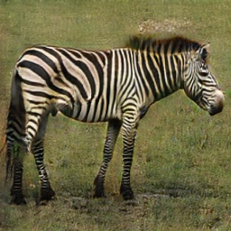
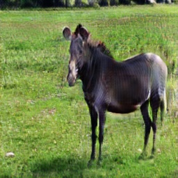

# Image Converter CycleGAN

Lei Mao

University of Chicago

## Introduction

Unlike ordinary pixel-to-pixel translation models, cycle-consistent adversarial networks (CycleGAN) has been proved to be useful for image translations without using paired data. This is a reproduced implementation of CycleGAN for image translations, but it is more compact.


## Dependencies

* Python 3.5
* Numpy 1.14
* TensorFlow 1.8
* ProgressBar2 3.37.1
* OpenCV 3.4


## Files

```
.
├── data
├── demo
├── download.py
├── LICENSE.md
├── model
├── model.py
├── module.py
├── README.md
├── train.py
└── utils.py
```


## Usage

### Download Dataset

Download and unzip specified dataset to designated directories.

```bash
$ python download.py --help
usage: download.py [-h] [--download_dir DOWNLOAD_DIR] [--data_dir DATA_DIR]
                   [--datasets DATASETS [DATASETS ...]]

Download CycleGAN datasets.

optional arguments:
  -h, --help            show this help message and exit
  --download_dir DOWNLOAD_DIR
                        Download directory for zipped data
  --data_dir DATA_DIR   Data directory for unzipped data
  --datasets DATASETS [DATASETS ...]
                        Datasets to download: apple2orange,
                        summer2winter_yosemite, horse2zebra, monet2photo,
                        cezanne2photo, ukiyoe2photo, vangogh2photo, maps,
                        cityscapes, facades, iphone2dslr_flower, ae_photos
```

For example, to download ``apple2orange`` and ``horse2zebra`` datasets to ``download`` directory and extract to ``data`` directory:

```bash
$ python download.py --download_dir ./download --data_dir ./data --datasets apple2orange horse2zebra
```

### Train Model

To have a good conversion capability, the training would take at least 100 epochs, which could take very long time even using a NVIDIA GTX TITAN X graphic card. The model also consumes a lot of graphic card memories. But this could be reduced by reducing the number of convolution filters ``num_filters`` in the model.

```bash
$ python train.py --help
usage: train.py [-h] [--img_A_dir IMG_A_DIR] [--img_B_dir IMG_B_DIR]
                [--model_dir MODEL_DIR] [--model_name MODEL_NAME]
                [--random_seed RANDOM_SEED]
                [--validation_A_dir VALIDATION_A_DIR]
                [--validation_B_dir VALIDATION_B_DIR]
                [--output_dir OUTPUT_DIR]

Train CycleGAN model for datasets.

optional arguments:
  -h, --help            show this help message and exit
  --img_A_dir IMG_A_DIR
                        Directory for A images.
  --img_B_dir IMG_B_DIR
                        Directory for B images.
  --model_dir MODEL_DIR
                        Directory for saving models.
  --model_name MODEL_NAME
                        File name for saving model.
  --random_seed RANDOM_SEED
                        Random seed for model training.
  --validation_A_dir VALIDATION_A_DIR
                        Convert validation A images after each training epoch.
                        If set none, no conversion would be done during the
                        training.
  --validation_B_dir VALIDATION_B_DIR
                        Convert validation B images after each training epoch.
                        If set none, no conversion would be done during the
                        training.
  --output_dir OUTPUT_DIR
                        Output directory for converted validation images.
```

For example, to train CycleGAN model for ``horse2zebra`` dataset:

```bash
$ python train.py --img_A_dir ./data/horse2zebra/trainA --img_B_dir ./data/horse2zebra/trainB --model_dir ./model/horse_zebra --model_name horse_zebra.ckpt --random_seed 0 --validation_A_dir ./data/horse2zebra/testA --validation_B_dir ./data/horse2zebra/testB --output_dir ./validation_output
```
With ``validation_A_dir``, ``validation_B_dir``, and ``output_dir`` set, we could monitor the conversion of validation images after each epoch using our bare eye. 

### Image Conversion

Convert images using pre-trained models.

```bash
$ python convert.py --help
usage: convert.py [-h] [--model_filepath MODEL_FILEPATH] [--img_dir IMG_DIR]
                  [--conversion_direction CONVERSION_DIRECTION]
                  [--output_dir OUTPUT_DIR]

Convert images using pre-trained CycleGAN model.

optional arguments:
  -h, --help            show this help message and exit
  --model_filepath MODEL_FILEPATH
                        File path for the pre-trained model.
  --img_dir IMG_DIR     Directory for the images for conversion.
  --conversion_direction CONVERSION_DIRECTION
                        Conversion direction for CycleGAN. A2B or B2A. The
                        first object in the model file name is A, and the
                        second object in the model file name is B.
  --output_dir OUTPUT_DIR
                        Directory for the converted images.
```

To convert images, put images into ``img_dir`` and run the following commands in the terminal, the converted images would be saved in the ``output_dir``:

```bash
$ python convert.py --model_filepath ./model/horse_zebra/horse_zebra.ckpt --img_dir ./data/horse2zebra/testA --conversion_direction A2B --output_dir ./converted_images
```
The convention for ``conversion_direction`` is first object in the model file name is A, and the second object in the model file name is B. In this case, ``horse = A`` and ``zebra = B``.

## Demo

### Horse and Zebra Conversion

The horse and zebra conversion model was trained for more than 500 epochs, and some of the selected test images were presented below.

Horse| Horse to Zebra | Zebra | Zebra to Horse |
:-------------------------:|:-------------------------:|:-------------------------:|:-------------------------:
  |   |  |  

It should be noted that the above presented conversions look extremely well. However, for most of the test images, the conversions always have defects which are visually pickable. Most horses or zebras that have "abnormal" poses does not convert well. The conversion of zebra to horse looks worse than the conversion of horse to zebra. I think one of the reasons that the conversions have defects is that the dataset is small and it does not contain all the poses for horse and zebra.

The test images after 200 epochs does not look too much different to the test images after 500 epochs, although the training loss kept decreasing. 

Download pre-trained [horse-zebra](https://drive.google.com/open?id=1_6TMfAK4q_4tUGEWzAxIQNBKo3E9CIq5) conversion model from Google Drive.

## References

* Jun-Yan Zhu, Taesung Park, Phillip Isola, Alexei A. Efros. Unpaired Image-to-Image Translation using Cycle-Consistent Adversarial Networks. 2017.
* Xiaowei Hu's CycleGAN TensorFlow Implementation [Repository](https://github.com/xhujoy)
* Hardik Bansal's CycleGAN TensorFlow Implementation [Repository](https://github.com/hardikbansal)

## To-Do List

- [ ] Create a ``main.py`` file
- [ ] Pre-train more models for different conversions
